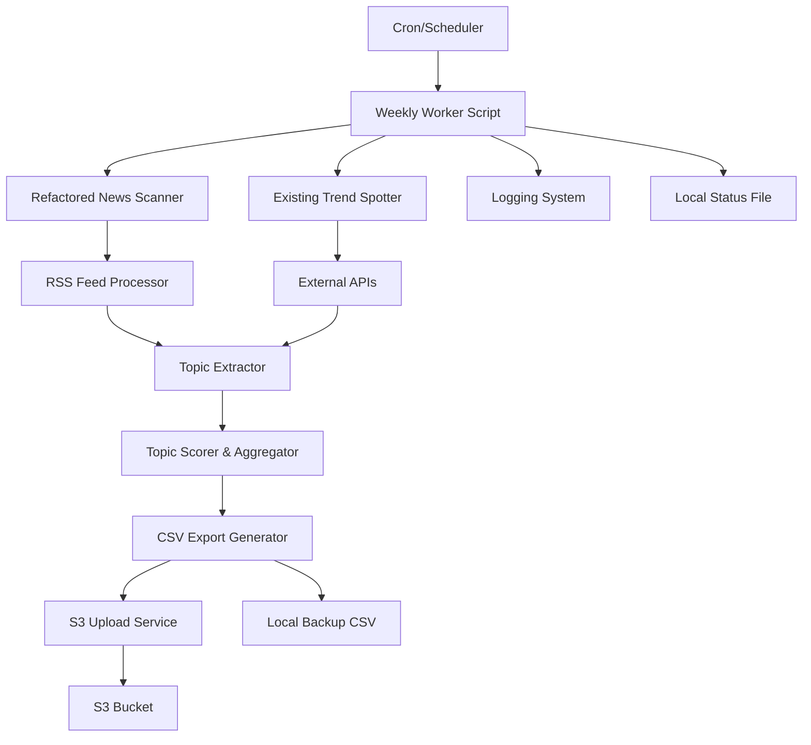

# Design Document

## Overview

The weekly trend worker system will refactor the existing news scanner to use high-quality RSS feeds from major tech companies and create an automated pipeline that runs weekly to discover trending topics and export them to CSV files uploaded to S3. The system will integrate with the existing TrendSpotter while eliminating database dependencies and providing a standalone, schedulable worker script.

## Architecture

### High-Level Architecture



### Component Integration

The system will leverage existing components while adding new functionality:

- **Existing**: TrendSpotter class for external API integration
- **New**: Refactored TechNewsScanner with specific RSS feeds
- **New**: WeeklyTrendWorker orchestration class
- **New**: CSV Export Generator for structured data output
- **New**: S3 Upload Service for cloud storage
- **New**: Standalone worker script with file-based status tracking

## Components and Interfaces

### 1. Refactored TechNewsScanner

**Purpose**: Process RSS feeds from authoritative tech sources

**Interface**:
```python
class TechNewsScanner:
    def __init__(self):
        # Configure specific RSS feeds

    async def scan_tech_news(self) -> List[Dict]:
        # Process all configured feeds

    async def _scan_rss_feed(self, source: Dict) -> List[Dict]:
        # Process individual RSS feed

    def _extract_topics_from_articles(self, articles: List[Dict]) -> List[Dict]:
        # Extract trending topics with improved keyword matching
```

**Key Changes**:
- Replace current RSS sources with specified feeds
- Enhance topic extraction with better keyword matching
- Add source attribution and confidence scoring
- Improve error handling for individual feed failures

### 2. WeeklyTrendWorker

**Purpose**: Orchestrate the weekly trend discovery process

**Interface**:
```python
class WeeklyTrendWorker:
    def __init__(self):
        # Initialize components and database connection

    async def run_weekly_discovery(self) -> Dict:
        # Main orchestration method

    async def _collect_news_trends(self) -> List[Dict]:
        # Use refactored news scanner

    async def _collect_external_trends(self) -> Dict:
        # Use existing trend spotter

    async def _aggregate_and_score_trends(self, news_trends: List[Dict], external_trend: Dict) -> List[Dict]:
        # Combine and score all trends

    async def _export_trends_to_csv(self, trends: List[Dict]) -> str:
        # Export trends to CSV file with structured format

    async def _upload_to_s3(self, csv_file_path: str) -> str:
        # Upload CSV file to S3 bucket with timestamped naming

    def _check_concurrent_execution(self) -> bool:
        # Prevent concurrent runs
```

### 3. Standalone Worker Script

**Purpose**: Provide executable entry point for scheduling

**Interface**:
```python
# scripts/weekly_trend_worker.py
async def main():
    # Initialize logging and S3 client
    # Run worker with error handling
    # Update local status file
    # Return appropriate exit codes

if __name__ == "__main__":
    # Command-line execution with S3 configuration
```

## Data Models

### CSV Export Structure

Trending topics will be exported as CSV with the following structure:

```csv
topic,source,score,news_score,external_score,sources,article_count,discovery_method,confidence_level,discovered_at,duplicate_flag
"AI Code Generation","weekly_worker",0.85,0.7,0.9,"netflix_tech,aws_blog,hacker_news",15,"rss_analysis","high","2025-01-15T10:00:00Z",false
```

**Column Definitions**:
- `topic`: The trending topic name
- `source`: Always "weekly_worker" for this system
- `score`: Combined confidence score (0-1)
- `news_score`: RSS feed analysis score (0-1) 
- `external_score`: External API trend score (0-1)
- `sources`: Comma-separated list of contributing RSS sources
- `article_count`: Number of articles mentioning this topic
- `discovery_method`: Method used for discovery ("rss_analysis", "api_analysis", "combined")
- `confidence_level`: Human-readable confidence ("low", "medium", "high")
- `discovered_at`: ISO timestamp of discovery
- `duplicate_flag`: Boolean indicating if this is a potential duplicate

### Worker Status Tracking

Local status file will track worker execution:

```json
{
    "worker_type": "weekly_trend_worker",
    "last_run_status": "completed",
    "last_started_at": "2025-01-15T10:00:00Z",
    "last_completed_at": "2025-01-15T10:15:00Z",
    "trends_discovered": 23,
    "csv_file_uploaded": "s3://bucket/trends/weekly-trends-2025-01-15.csv",
    "error_message": null,
    "next_scheduled_run": "2025-01-22T10:00:00Z"
}
```

## Error Handling

### RSS Feed Processing
- Individual feed failures will not stop the entire process
- Failed feeds will be logged with detailed error information
- Retry logic with exponential backoff for temporary failures
- Graceful degradation when multiple feeds are unavailable

### S3 Upload Operations
- Upload retry logic with exponential backoff for failed uploads
- Local backup storage when S3 is unavailable
- Detailed logging of upload errors and retry attempts
- Graceful handling of network timeouts and authentication failures

### External API Integration
- Leverage existing TrendSpotter error handling
- Fallback to RSS-only analysis if external APIs fail
- Timeout handling for slow API responses

### Concurrent Execution Prevention
- File-based locking mechanism to prevent concurrent runs
- Cleanup of stale lock files
- Graceful handling of interrupted executions

## Testing Strategy

### Unit Tests
- **TechNewsScanner**: Test RSS feed parsing, topic extraction, error handling
- **WeeklyTrendWorker**: Test orchestration logic, aggregation algorithms
- **CSV Export**: Test CSV generation, column formatting, data validation
- **S3 Upload**: Test upload logic, retry mechanisms, local backup creation

### Integration Tests
- **End-to-End Worker**: Test complete workflow from RSS feeds to S3 storage
- **S3 Integration**: Test with real S3 connections and bucket operations
- **Error Scenarios**: Test behavior with failed feeds, API timeouts, S3 upload failures

### Mock Testing
- Mock RSS feeds for consistent testing
- Mock external APIs to test fallback scenarios
- Mock S3 operations for unit test isolation
- Mock file system operations for status file testing

### Performance Tests
- Test with large RSS feeds
- Test concurrent S3 upload operations  
- Memory usage monitoring during CSV generation and processing

## Configuration Management

### RSS Feed Configuration
```python
RSS_SOURCES = [
    {
        "name": "Netflix Tech Blog",
        "rss_url": "https://netflixtechblog.com/feed",
        "weight": 0.9,
        "timeout": 30
    },
    # ... other sources
]
```

### Worker Configuration
```python
WORKER_CONFIG = {
    "max_trends_per_run": 50,
    "score_threshold": 0.3,
    "concurrent_execution_check": True,
    "retry_attempts": 3,
    "retry_delay": 5,
    "s3_bucket": "trending-topics-data",
    "s3_key_prefix": "trends/weekly-trends",
    "local_backup_dir": "./data/backups",
    "status_file_path": "./data/worker_status.json"
}
```

### S3 Configuration
```python
S3_CONFIG = {
    "bucket_name": "trending-topics-data", 
    "region": "us-east-1",
    "key_prefix": "trends/",
    "file_naming_pattern": "weekly-trends-{timestamp}.csv",
    "metadata_tags": {
        "source": "weekly-trend-worker",
        "data_type": "trending_topics"
    }
}
```

## Deployment and Scheduling

### Cron Integration
```bash
# Run every Sunday at 2 AM
0 2 * * 0 /path/to/venv/bin/python /path/to/scripts/weekly_trend_worker.py
```

### Docker Integration
- Worker script will be compatible with existing Docker setup
- Environment variables for S3 credentials and configuration
- Proper signal handling for graceful shutdown
- Volume mounts for local backup storage

### Monitoring and Alerting
- Structured logging for monitoring systems
- Exit codes for alerting on failures
- S3 upload success/failure metrics
- Local status file for health monitoring
- CloudWatch metrics integration for S3 upload tracking