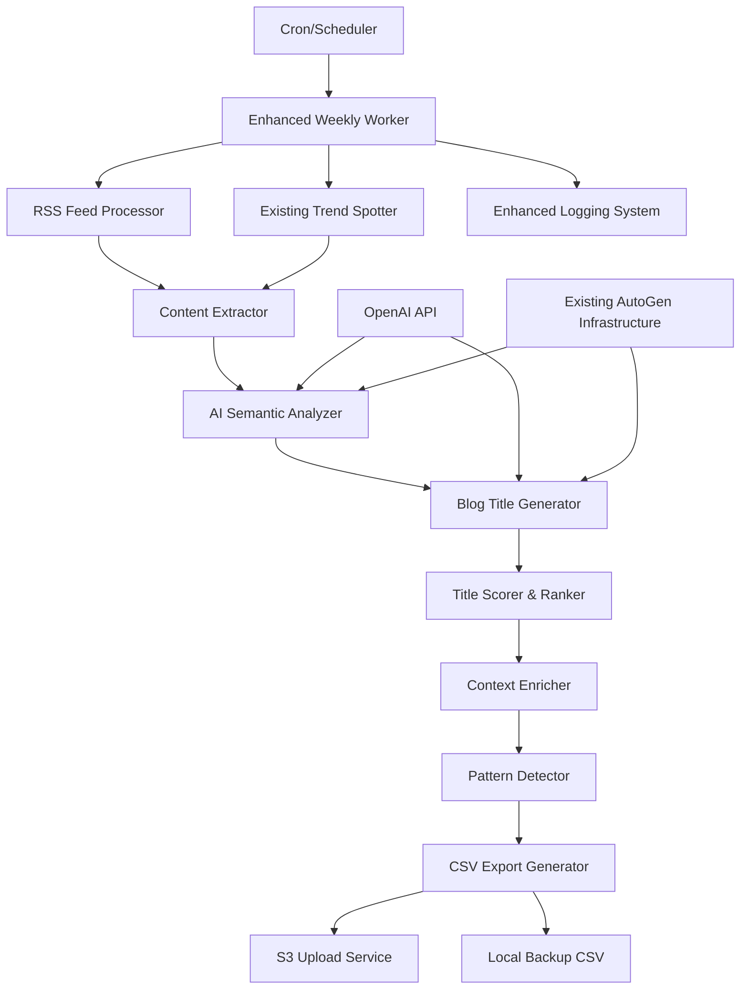

# Design Document

## Overview

The Enhanced Blog Title Discovery system extends the existing weekly trend worker to generate specific, actionable blog post titles using AI-powered semantic analysis. Instead of producing general topics like "Machine Learning" or "React", the system will create detailed, engaging titles such as "How Netflix reduced React bundle size by 35% with selective hydration" or "Why Stripe migrated from REST to GraphQL for payment processing APIs".

The system leverages the existing OpenAI/AutoGen infrastructure and RSS feed processing capabilities while adding sophisticated content analysis and title generation components.

## Architecture

### High-Level Architecture



### Component Integration

The system builds upon existing infrastructure:

- **Existing**: OpenAI/AutoGen integration from multi-agent blog writer
- **Existing**: RSS feed processing from weekly trend worker
- **Existing**: TrendSpotter for external API integration
- **New**: AI Semantic Analyzer for content understanding
- **New**: Blog Title Generator for specific title creation
- **New**: Context Enricher for supporting information
- **New**: Pattern Detector for theme identification

## Components and Interfaces

### 1. Enhanced Content Extractor

**Purpose**: Extract and preprocess article content for AI analysis

**Interface**:
```python
class EnhancedContentExtractor:
    def __init__(self):
        # Initialize with existing RSS sources and new extraction patterns

    async def extract_article_content(self, rss_articles: List[Dict]) -> List[ArticleContent]:
        # Extract full content, summaries, and metadata

    def _extract_technical_details(self, content: str) -> TechnicalDetails:
        # Extract metrics, version numbers, company names, technologies

    def _identify_content_patterns(self, content: str) -> ContentPatterns:
        # Identify "How-to", "Why", "X ways to", performance improvement patterns
```

**Key Features**:
- Extract article summaries, full content when available
- Identify technical metrics, version numbers, company names
- Detect content patterns that indicate actionable topics
- Preserve source attribution and publication dates

### 2. AI Semantic Analyzer

**Purpose**: Use OpenAI/LLM for deep semantic analysis of article content

**Interface**:
```python
class AISemanticAnalyzer:
    def __init__(self, openai_client: OpenAIChatCompletionClient):
        # Leverage existing OpenAI infrastructure

    async def analyze_content_semantics(self, articles: List[ArticleContent]) -> List[SemanticInsight]:
        # Perform semantic analysis using OpenAI

    async def _extract_implicit_topics(self, content: str) -> List[ImplicitTopic]:
        # Find topics not explicitly stated in titles

    async def _identify_technical_concepts(self, content: str) -> List[TechnicalConcept]:
        # Extract technical implementations, solutions, problems solved
```

**AI Prompts**:
- Content analysis prompt for extracting technical insights
- Topic synthesis prompt for combining multiple sources
- Title generation prompt with specific formatting requirements

### 3. Blog Title Generator

**Purpose**: Generate specific, engaging blog post titles using AI

**Interface**:
```python
class BlogTitleGenerator:
    def __init__(self, openai_client: OpenAIChatCompletionClient):
        # Use existing OpenAI client configuration

    async def generate_specific_titles(self, insights: List[SemanticInsight]) -> List[BlogTitleCandidate]:
        # Generate specific, actionable blog titles

    async def _create_performance_titles(self, insight: SemanticInsight) -> List[str]:
        # "How X improved Y by Z%" pattern titles

    async def _create_comparison_titles(self, insight: SemanticInsight) -> List[str]:
        # "Why X outperforms Y in Z scenarios" pattern titles

    async def _create_implementation_titles(self, insight: SemanticInsight) -> List[str]:
        # "How to implement X using Y for Z results" pattern titles
```

**Title Patterns**:
- Performance improvements: "How [Company] reduced [Metric] by [Percentage] using [Technology]"
- Technical comparisons: "Why [Technology A] outperforms [Technology B] for [Use Case]"
- Implementation guides: "[Number] ways to optimize [Process] with [Technology]"
- Problem-solution: "How [Company] solved [Problem] with [Innovative Solution]"

### 4. Title Scorer & Ranker

**Purpose**: Score and rank blog titles based on specificity and engagement potential

**Interface**:
```python
class TitleScorerRanker:
    def __init__(self):
        # Initialize scoring algorithms and weights

    def score_title_specificity(self, title: BlogTitleCandidate) -> float:
        # Score based on metrics, version numbers, company names

    def score_engagement_potential(self, title: BlogTitleCandidate) -> float:
        # Score based on actionability, problem-solving, recency

    def rank_titles(self, titles: List[BlogTitleCandidate]) -> List[RankedBlogTitle]:
        # Combine scores and rank titles
```

**Scoring Factors**:
- **Specificity Score** (0-1): Presence of metrics, versions, company names, concrete details
- **Engagement Score** (0-1): Problem-solving potential, actionability, trending technologies
- **Recency Score** (0-1): How recent the source content is
- **Authority Score** (0-1): Source credibility and technical depth

### 5. Context Enricher

**Purpose**: Provide supporting context and information for each blog title

**Interface**:
```python
class ContextEnricher:
    def __init__(self):
        # Initialize context extraction patterns

    async def enrich_title_context(self, title: RankedBlogTitle) -> EnrichedBlogTitle:
        # Add context, supporting details, suggested angles

    def _extract_supporting_details(self, source_content: str) -> SupportingDetails:
        # Extract code examples, metrics, implementation challenges

    def _suggest_content_angles(self, title: str, context: Dict) -> List[ContentAngle]:
        # Suggest approaches for comprehensive coverage
```

**Context Information**:
- Source articles and attribution
- Key technologies and concepts mentioned
- Supporting metrics and performance data
- Suggested content angles and approaches
- Target audience and technical depth indicators

### 6. Pattern Detector

**Purpose**: Identify emerging patterns and connect related blog ideas

**Interface**:
```python
class PatternDetector:
    def __init__(self):
        # Initialize pattern recognition algorithms

    def detect_emerging_themes(self, titles: List[EnrichedBlogTitle]) -> List[EmergingTheme]:
        # Identify common themes across multiple sources

    def suggest_content_series(self, titles: List[EnrichedBlogTitle]) -> List[ContentSeries]:
        # Group related titles into potential series

    def identify_trend_connections(self, titles: List[EnrichedBlogTitle]) -> List[TrendConnection]:
        # Show how different titles connect to broader trends
```

## Data Models

### Enhanced CSV Export Structure

Blog titles will be exported with comprehensive context:

```csv
blog_title,specificity_score,engagement_score,overall_score,source_articles,key_technologies,supporting_metrics,content_angle,target_audience,technical_depth,emerging_theme,series_potential,discovered_at,confidence_level
"How Stripe reduced payment processing latency by 40% with GraphQL federation",0.95,0.88,0.91,"stripe_engineering_blog","GraphQL,Payment Processing,Microservices","40% latency reduction,99.9% uptime","Implementation deep-dive","Senior Engineers","High","API Optimization","Payment Infrastructure Series","2025-01-15T10:00:00Z","high"
```

**Enhanced Column Definitions**:
- `blog_title`: Specific, actionable blog post title
- `specificity_score`: Score based on concrete details (0-1)
- `engagement_score`: Potential audience engagement (0-1)
- `overall_score`: Combined ranking score (0-1)
- `source_articles`: Comma-separated source article URLs
- `key_technologies`: Technologies mentioned in the content
- `supporting_metrics`: Performance data, statistics, measurements
- `content_angle`: Suggested approach for covering the topic
- `target_audience`: Intended reader skill level
- `technical_depth`: Required technical knowledge level
- `emerging_theme`: Broader theme this title belongs to
- `series_potential`: Related titles for content series
- `discovered_at`: ISO timestamp of discovery
- `confidence_level`: AI confidence in title quality

### AI Analysis Models

```python
@dataclass
class ArticleContent:
    title: str
    summary: str
    full_content: Optional[str]
    source_url: str
    published_date: datetime
    technical_details: TechnicalDetails
    content_patterns: ContentPatterns

@dataclass
class SemanticInsight:
    implicit_topics: List[str]
    technical_concepts: List[str]
    problems_solved: List[str]
    solutions_implemented: List[str]
    performance_metrics: List[str]
    confidence_score: float

@dataclass
class BlogTitleCandidate:
    title: str
    pattern_type: str  # "performance", "comparison", "implementation", "problem-solution"
    source_insights: List[SemanticInsight]
    generated_by: str  # "ai_semantic_analysis"

@dataclass
class EnrichedBlogTitle:
    title: str
    scores: TitleScores
    context: TitleContext
    supporting_details: SupportingDetails
    content_angles: List[ContentAngle]
    connections: List[TrendConnection]
```

## AI Integration Strategy

### OpenAI Prompt Engineering

**Content Analysis Prompt**:
```
Analyze this technical article and extract:
1. Specific technical implementations or solutions
2. Performance improvements with metrics
3. Problems solved and approaches used
4. Technologies, frameworks, or tools mentioned
5. Implicit topics not stated in the title

Article: {article_content}

Focus on actionable, specific details that would make compelling blog post topics.
```

**Title Generation Prompt**:
```
Based on this technical insight, generate 3-5 specific, engaging blog post titles that follow these patterns:
- "How [Company] achieved [Specific Result] with [Technology]"
- "Why [Technology] outperforms [Alternative] for [Use Case]"
- "[Number] ways to optimize [Process] using [Technology]"
- "How to solve [Problem] with [Innovative Solution]"

Insight: {semantic_insight}

Make titles specific, actionable, and include concrete details like metrics, version numbers, or company names when available.
```

### Error Handling and Fallbacks

- **API Rate Limiting**: Implement exponential backoff and request queuing
- **Content Analysis Failures**: Fall back to keyword-based extraction
- **Title Generation Failures**: Use template-based title generation
- **Semantic Analysis Errors**: Log errors and continue with available data

## Testing Strategy

### Unit Tests

- **Content Extraction**: Test with various RSS article formats
- **AI Integration**: Mock OpenAI responses for consistent testing
- **Title Generation**: Verify title patterns and specificity
- **Scoring Algorithms**: Test ranking logic with known good/bad titles

### Integration Tests

- **End-to-End AI Pipeline**: Test complete flow from RSS to generated titles
- **OpenAI Integration**: Test with real API calls (rate-limited)
- **CSV Export**: Verify enhanced export format and data integrity

### AI Quality Tests

- **Title Specificity**: Measure concrete details in generated titles
- **Engagement Potential**: Test titles against engagement criteria
- **Semantic Accuracy**: Verify AI extracts relevant technical concepts

## Configuration Management

### AI Configuration

```python
AI_CONFIG = {
    "openai_model": "gpt-4",  # Use existing model configuration
    "temperature": 0.3,  # Lower temperature for more focused output
    "max_tokens": 2000,
    "content_analysis_prompt": "...",
    "title_generation_prompt": "...",
    "batch_size": 5,  # Process articles in batches
    "retry_attempts": 3,
    "rate_limit_delay": 1.0
}
```

### Enhanced Worker Configuration

```python
ENHANCED_WORKER_CONFIG = {
    "min_specificity_score": 0.6,  # Filter out generic titles
    "max_titles_per_run": 30,
    "enable_ai_analysis": True,
    "fallback_to_keywords": True,
    "content_analysis_timeout": 60,
    "title_generation_timeout": 30
}
```

## Performance Considerations

### AI API Usage Optimization

- **Batch Processing**: Process multiple articles in single API calls
- **Caching**: Cache semantic analysis results for similar content
- **Rate Limiting**: Respect OpenAI API rate limits
- **Cost Management**: Monitor token usage and implement limits

### Processing Efficiency

- **Parallel Processing**: Analyze articles concurrently where possible
- **Content Filtering**: Skip articles that don't meet minimum criteria
- **Smart Batching**: Group similar articles for more efficient analysis

## Deployment Integration

### Existing Infrastructure Compatibility

- **OpenAI Client**: Reuse existing OpenAI configuration and client setup
- **Environment Variables**: Leverage existing OPENAI_API_KEY and model settings
- **Logging**: Extend existing logging infrastructure
- **Error Handling**: Follow existing error handling patterns

### Monitoring and Alerting

- **AI API Metrics**: Track API usage, costs, and response times
- **Title Quality Metrics**: Monitor specificity and engagement scores
- **Processing Success Rates**: Track successful title generation rates
- **Cost Monitoring**: Alert on unexpected API usage spikes