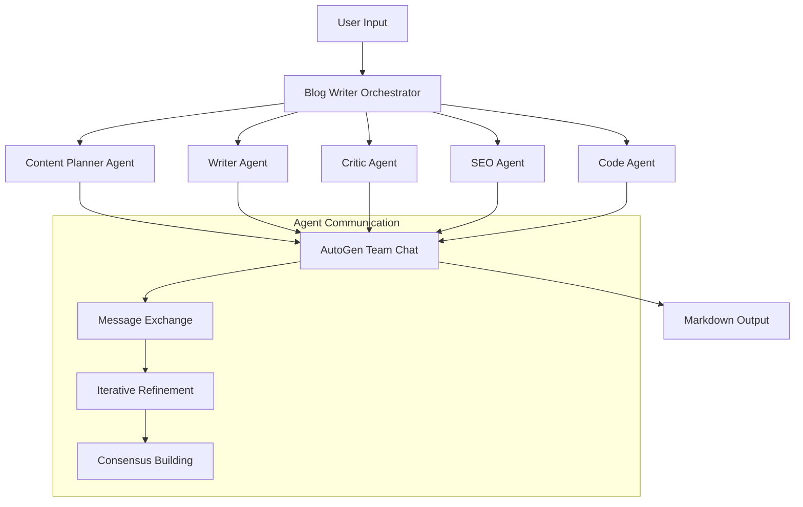
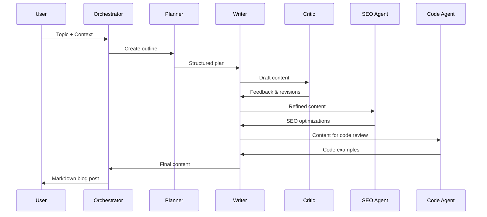

# Design Document

## Overview

The multi-agent blog writing system is designed as a collaborative AI workflow using Microsoft AutoGen 0.7. The system orchestrates five specialized agents that work together to transform a topic and optional context into a comprehensive, SEO-optimized markdown blog post. The architecture follows AutoGen's conversation-based approach where agents communicate through structured messages to iteratively improve the content.

The system leverages AutoGen's `RoundRobinGroupChat` for agent coordination and uses OpenAI's GPT models through the `OpenAIChatCompletionClient`. Each agent has a specific role and expertise, ensuring comprehensive coverage of content creation aspects from planning to final optimization.

## Architecture

### High-Level Architecture



### Agent Workflow



## Components and Interfaces

### 1. BlogWriterOrchestrator

**Purpose**: Main entry point that coordinates the entire multi-agent workflow.

**Interface**:
```python
class BlogWriterOrchestrator:
    async def generate_blog(
        self,
        topic: str,
        description: Optional[str] = None,
        book_reference: Optional[str] = None
    ) -> BlogResult
```

**Responsibilities**:
- Initialize and configure all agents
- Manage the conversation flow between agents
- Handle error recovery and partial content saving
- Output final markdown file

### 2. ContentPlannerAgent

**Purpose**: Creates structured outlines and content strategy.

**Interface**:
```python
class ContentPlannerAgent(AssistantAgent):
    async def create_outline(self, topic: str, context: str) -> ContentOutline
    async def refine_outline(self, feedback: str) -> ContentOutline
```

**System Message**: Specialized in content strategy, audience analysis, and structural planning.

### 3. WriterAgent

**Purpose**: Generates the actual blog content based on the approved outline.

**Interface**:
```python
class WriterAgent(AssistantAgent):
    async def write_content(self, outline: ContentOutline) -> BlogContent
    async def revise_content(self, feedback: str) -> BlogContent
```

**System Message**: Expert in technical writing, maintaining consistent tone and style.

### 4. CriticAgent

**Purpose**: Reviews and provides feedback on content quality, structure, and clarity.

**Interface**:
```python
class CriticAgent(AssistantAgent):
    async def review_content(self, content: BlogContent) -> ReviewFeedback
    async def approve_content(self, content: BlogContent) -> bool
```

**System Message**: Focused on editorial standards, readability, and content improvement.

### 5. SEOAgent

**Purpose**: Optimizes content for search engines and trending keywords.

**Interface**:
```python
class SEOAgent(AssistantAgent):
    async def analyze_keywords(self, topic: str) -> KeywordAnalysis
    async def optimize_content(self, content: BlogContent) -> SEOOptimizedContent
```

**System Message**: Specialized in SEO best practices, keyword research, and content optimization.

### 6. CodeAgent

**Purpose**: Adds relevant code examples and technical snippets when appropriate.

**Interface**:
```python
class CodeAgent(AssistantAgent):
    async def identify_code_opportunities(self, content: BlogContent) -> List[CodeOpportunity]
    async def generate_code_examples(self, opportunities: List[CodeOpportunity]) -> List[CodeExample]
```

**System Message**: Expert in writing clean, well-commented code examples with proper formatting.

## Data Models

### Core Data Structures

```python
@dataclass
class BlogInput:
    topic: str
    description: Optional[str] = None
    book_reference: Optional[str] = None
    target_audience: str = "intermediate"
    preferred_length: int = 1500

@dataclass
class ContentOutline:
    title: str
    introduction: str
    sections: List[Section]
    conclusion: str
    estimated_word_count: int
    target_keywords: List[str]

@dataclass
class Section:
    heading: str
    key_points: List[str]
    code_examples_needed: bool
    estimated_words: int

@dataclass
class BlogContent:
    title: str
    content: str  # Markdown formatted
    word_count: int
    sections: List[str]
    code_blocks: List[CodeBlock]
    metadata: ContentMetadata

@dataclass
class CodeBlock:
    language: str
    code: str
    explanation: str
    line_numbers: bool = True

@dataclass
class BlogResult:
    content: str  # Final markdown
    metadata: Dict[str, Any]
    generation_log: List[AgentMessage]
    success: bool
    error_message: Optional[str] = None

@dataclass
class AgentMessage:
    agent_name: str
    message_type: str  # 'outline', 'content', 'feedback', 'code'
    content: str
    timestamp: datetime
```

### Configuration Models

```python
@dataclass
class AgentConfig:
    model: str = "gpt-4"
    temperature: float = 0.7
    max_tokens: int = 4000
    openai_api_key: str

@dataclass
class WorkflowConfig:
    max_iterations: int = 3
    enable_code_agent: bool = True
    output_format: str = "markdown"
    save_conversation_log: bool = True
```

## Error Handling

### Error Recovery Strategy

1. **Agent Failure Recovery**:
   - If an agent fails, retry with exponential backoff
   - Fall back to simplified prompts if complex ones fail
   - Continue workflow with remaining agents if one is non-critical

2. **Partial Content Preservation**:
   - Save intermediate results at each major step
   - Allow manual completion if automated process fails
   - Provide detailed error logs for debugging

3. **Graceful Degradation**:
   - Code agent is optional - workflow continues without code examples
   - SEO optimization can be skipped if external services fail
   - Basic content generation always attempted even if advanced features fail

### Error Types and Handling

```python
class BlogGenerationError(Exception):
    """Base exception for blog generation errors"""
    pass

class AgentCommunicationError(BlogGenerationError):
    """Raised when agents cannot communicate effectively"""
    pass

class ContentQualityError(BlogGenerationError):
    """Raised when content doesn't meet quality standards"""
    pass

class SEOServiceError(BlogGenerationError):
    """Raised when SEO services are unavailable"""
    pass
```

## Testing Strategy

### Unit Testing

1. **Individual Agent Testing**:
   - Mock OpenAI API responses for consistent testing
   - Test each agent's system message and response parsing
   - Validate agent-specific functionality in isolation

2. **Data Model Testing**:
   - Test serialization/deserialization of all data structures
   - Validate data model constraints and relationships
   - Test edge cases for optional fields

### Integration Testing

1. **Agent Communication Testing**:
   - Test message passing between agents
   - Validate conversation flow and turn management
   - Test error propagation and recovery

2. **End-to-End Workflow Testing**:
   - Test complete blog generation with various topics
   - Validate markdown output format and quality
   - Test with different input combinations

### Performance Testing

1. **Response Time Testing**:
   - Measure total generation time for different content lengths
   - Test concurrent blog generation requests
   - Monitor API rate limits and costs

2. **Quality Metrics**:
   - Automated readability scoring
   - SEO score validation
   - Code example syntax checking

### Test Data and Scenarios

```python
TEST_SCENARIOS = [
    {
        "topic": "Introduction to FastAPI",
        "description": "Beginner-friendly tutorial",
        "expected_sections": ["Installation", "Basic Example", "Advanced Features"],
        "should_include_code": True
    },
    {
        "topic": "Machine Learning Ethics",
        "description": "Discussion of ethical considerations",
        "expected_sections": ["Bias", "Privacy", "Transparency"],
        "should_include_code": False
    },
    {
        "topic": "Docker Best Practices",
        "book_reference": "Docker Deep Dive by Nigel Poulton",
        "expected_sections": ["Dockerfile Optimization", "Security", "Multi-stage Builds"],
        "should_include_code": True
    }
]
```

## Implementation Considerations

### AutoGen 0.7 Specific Features

1. **Model Client Configuration**:
   - Use `OpenAIChatCompletionClient` for consistent API access
   - Configure temperature and token limits per agent role
   - Handle API rate limiting and retries

2. **Team Chat Management**:
   - Implement `RoundRobinGroupChat` for structured agent interaction
   - Set appropriate `max_turns` to prevent infinite loops
   - Use cancellation tokens for timeout handling

3. **Message Handling**:
   - Structure messages with clear agent roles and responsibilities
   - Implement message parsing for extracting structured data
   - Handle message history for context preservation

### Performance Optimizations

1. **Parallel Processing**:
   - Run independent agent tasks concurrently where possible
   - Cache frequently used prompts and responses
   - Implement request batching for API efficiency

2. **Content Caching**:
   - Cache SEO keyword research results
   - Store successful agent conversations for similar topics
   - Implement content template reuse

3. **Resource Management**:
   - Monitor token usage across all agents
   - Implement cost tracking and limits
   - Optimize prompt engineering for efficiency