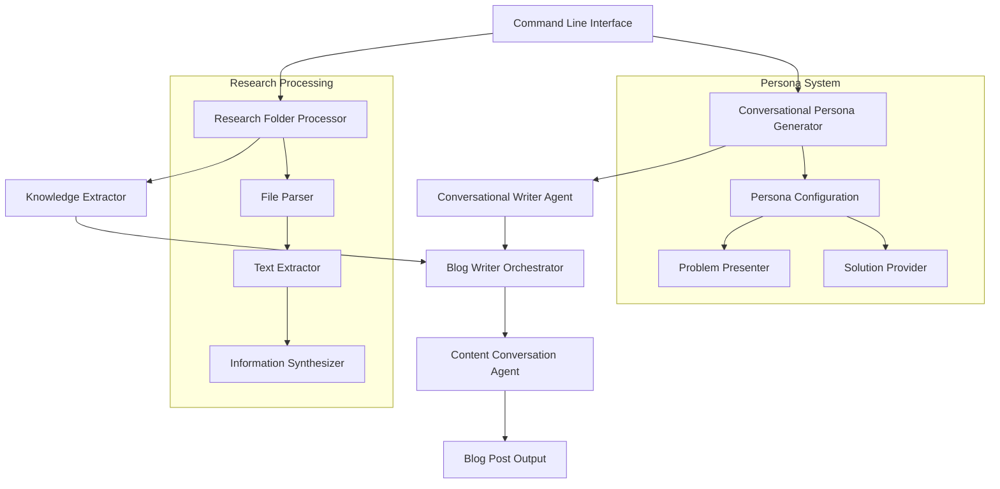

# Design Document

## Overview

The Conversational Developer Blog Writer enhances the existing multi-agent blog writing system to generate developer-focused content in an engaging conversational format. The system creates dialogue between two distinct personas - a "Problem Presenter" who discusses real-world development challenges and a "Solution Provider" who offers practical technology solutions.

The enhancement integrates seamlessly with the existing `BlogWriterOrchestrator` architecture while adding new capabilities for research folder consumption, persona management, and conversational content generation.

## Architecture

### High-Level Architecture



### Integration with Existing System

The conversational blog writer integrates with the existing multi-agent system by:

1. **Extending the CLI**: Adding research folder and conversational mode parameters to `multi_agent_blog_writer.py`
2. **Enhancing WriterAgent**: Creating a specialized `ConversationalWriterAgent` that inherits from `WriterAgent`
3. **Research Integration**: Adding a `ResearchProcessor` that feeds into the existing content generation pipeline
4. **Persona Management**: Implementing configurable personas that influence content generation

## Components and Interfaces

### 1. Research Folder Processor

**Purpose**: Process and extract information from research materials provided by the user.

**Key Classes**:
- `ResearchProcessor`: Main coordinator for research processing
- `FileParser`: Handles different file formats (MD, TXT, PDF, JSON, etc.)
- `InformationExtractor`: Extracts key insights and technical details
- `KnowledgeBase`: Stores and organizes extracted information

**Interface**:
```python
class ResearchProcessor:
    async def process_folder(self, folder_path: Path) -> ResearchKnowledge
    async def extract_key_insights(self, files: List[Path]) -> List[Insight]
    async def synthesize_information(self, insights: List[Insight]) -> KnowledgeBase
```

### 2. Conversational Persona System

**Purpose**: Manage and maintain consistent conversational personas throughout the blog generation.

**Key Classes**:
- `PersonaManager`: Manages persona configurations and consistency
- `ProblemPresenter`: Persona that presents development challenges
- `SolutionProvider`: Persona that provides technical solutions
- `ConversationFlow`: Manages dialogue flow and transitions

**Interface**:
```python
class PersonaManager:
    def create_personas(self, config: PersonaConfig) -> Tuple[ProblemPresenter, SolutionProvider]
    def validate_consistency(self, dialogue: str) -> bool
    def suggest_improvements(self, dialogue: str) -> List[str]
```

### 3. Conversational Writer Agent

**Purpose**: Generate conversational content using the established personas and research knowledge.

**Key Classes**:
- `ConversationalWriterAgent`: Extends `WriterAgent` with conversational capabilities
- `DialogueGenerator`: Creates natural dialogue between personas
- `TechnicalContextualizer`: Ensures technical accuracy in conversations

**Interface**:
```python
class ConversationalWriterAgent(WriterAgent):
    async def write_conversational_content(
        self,
        outline: ContentOutline,
        blog_input: BlogInput,
        research_knowledge: ResearchKnowledge,
        personas: Tuple[ProblemPresenter, SolutionProvider]
    ) -> BlogContent
```

### 4. Enhanced CLI Interface

**Purpose**: Extend the existing command-line interface to support research folders and conversational mode.

**New Parameters**:
- `--research-folder`: Path to folder containing research materials
- `--conversational-mode`: Enable conversational format
- `--persona-config`: Path to persona configuration file
- `--dialogue-style`: Style of conversation (casual, formal, technical)

## Data Models

### Research Knowledge Models

```python
@dataclass
class ResearchFile:
    path: Path
    content: str
    file_type: str
    metadata: Dict[str, Any]
    extracted_insights: List[str]

@dataclass
class KnowledgeBase:
    insights: List[Insight]
    technical_details: List[TechnicalDetail]
    code_examples: List[CodeExample]
    references: List[Reference]
    summary: str

@dataclass
class Insight:
    content: str
    source_file: str
    confidence_score: float
    category: str  # problem, solution, technology, best_practice
```

### Persona Models

```python
@dataclass
class PersonaConfig:
    problem_presenter: PersonaProfile
    solution_provider: PersonaProfile
    conversation_style: ConversationStyle

@dataclass
class PersonaProfile:
    name: str
    background: str
    expertise_areas: List[str]
    communication_style: str
    personality_traits: List[str]

@dataclass
class ConversationStyle:
    formality_level: str  # casual, professional, technical
    technical_depth: str  # beginner, intermediate, advanced
    dialogue_pace: str    # quick, moderate, detailed
```

### Enhanced Blog Models

```python
@dataclass
class ConversationalBlogContent(BlogContent):
    dialogue_sections: List[DialogueSection]
    personas_used: Tuple[PersonaProfile, PersonaProfile]
    research_sources: List[str]
    conversation_flow_score: float

@dataclass
class DialogueSection:
    section_title: str
    exchanges: List[DialogueExchange]
    technical_focus: str

@dataclass
class DialogueExchange:
    speaker: str  # problem_presenter or solution_provider
    content: str
    technical_concepts: List[str]
    code_references: List[str]
```

## Error Handling

### Research Processing Errors

1. **File Access Errors**: Handle permissions, missing files, corrupted files
2. **Format Parsing Errors**: Graceful degradation when files can't be parsed
3. **Content Extraction Errors**: Fallback to basic text extraction
4. **Knowledge Synthesis Errors**: Continue with partial knowledge

### Conversational Generation Errors

1. **Persona Consistency Errors**: Validation and correction of character voice
2. **Dialogue Flow Errors**: Detection and repair of unnatural conversations
3. **Technical Accuracy Errors**: Validation against research knowledge
4. **Content Integration Errors**: Fallback to traditional blog format

### Error Recovery Strategies

- **Graceful Degradation**: Fall back to existing blog generation if conversational mode fails
- **Partial Success**: Generate content with available research/personas
- **User Feedback**: Provide clear error messages with suggested fixes
- **Retry Mechanisms**: Automatic retry for transient failures

## Testing Strategy

### Unit Testing

1. **Research Processor Tests**:
   - File parsing for different formats
   - Information extraction accuracy
   - Knowledge synthesis quality

2. **Persona System Tests**:
   - Persona consistency validation
   - Dialogue generation quality
   - Character voice maintenance

3. **Conversational Writer Tests**:
   - Content generation with personas
   - Research integration accuracy
   - Technical concept handling

### Integration Testing

1. **End-to-End Workflow Tests**:
   - Complete conversational blog generation
   - Research folder processing pipeline
   - CLI parameter handling

2. **Compatibility Tests**:
   - Integration with existing blog writer system
   - Backward compatibility with current CLI
   - Output format consistency

### Quality Assurance

1. **Content Quality Metrics**:
   - Dialogue naturalness scoring
   - Technical accuracy validation
   - Persona consistency measurement

2. **Performance Testing**:
   - Research processing speed
   - Memory usage with large research folders
   - Generation time comparison

### Test Data

1. **Sample Research Folders**:
   - Mixed file formats (MD, PDF, TXT, JSON)
   - Various technical topics
   - Different content sizes

2. **Persona Configurations**:
   - Different expertise levels
   - Various communication styles
   - Multiple technical domains

## Implementation Phases

### Phase 1: Research Processing Foundation
- Implement basic file parsing and content extraction
- Create knowledge base structure
- Add CLI parameters for research folder

### Phase 2: Persona System
- Implement persona configuration and management
- Create basic dialogue generation
- Integrate with existing writer agent

### Phase 3: Conversational Content Generation
- Develop conversational writer agent
- Implement dialogue flow management
- Add technical contextualization

### Phase 4: Integration and Enhancement
- Full integration with existing blog writer
- Advanced persona consistency checking
- Performance optimization and error handling

### Phase 5: Quality Assurance and Polish
- Comprehensive testing suite
- Documentation and examples
- User experience improvements